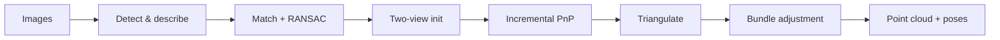

# SFM-SLAM

> **Repository:** [rbdlabhaifa/SFM-SLAM](https://github.com/rbdlabhaifa/SFM-SLAM)

## What is this project?

**SFM-SLAM** is a Python **Structure from Motion (SfM) scaffold** from the [RBD Lab, University of Haifa](https://github.com/rbdlabhaifa). It defines a classical incremental SfM pipeline — feature detection, matching, pose estimation, triangulation, and bundle adjustment — as an extensible `StructureFromMotion` class in [`sfm.py`](sfm.py).

The repo is meant for **coursework and prototyping**: students implement each stage themselves rather than calling a black-box tool like COLMAP.

## What does it do?

**Planned output (when fully implemented):** a sparse **3D point cloud** and **camera poses** from a set of overlapping images.

**What works today:**

1. **Pipeline skeleton** — `StructureFromMotion.run()` orchestrates all SfM stages in order.
2. **Keypoint demo** — [`demos/demo_keypoints.py`](demos/demo_keypoints.py) runs real OpenCV feature detection, matching, and RANSAC filtering on image pairs.
3. **Configurable inputs** — [`config.yaml.example`](config.yaml.example) for image paths, detector choice, and matcher settings.

**Typical workflow for a new developer:**

```bash
git clone https://github.com/rbdlabhaifa/SFM-SLAM.git
cd SFM-SLAM
python3 -m venv .venv && source .venv/bin/activate
pip install -r requirements.txt
cp config.yaml.example config.yaml   # set images_dir
python demos/demo_keypoints.py
```

Implement methods in `sfm.py` one at a time, then call `sfm.run()` when ready.

---

# 1. Project Overview

**Problem solved:** Learn and experiment with classical SfM without wrapping a full third-party reconstruction engine on day one.

**Current status:** Every method in `StructureFromMotion` except the orchestration in `run()` is a **`pass` stub**. Calling `run()` as-is will fail. Use the keypoint demo to validate your environment, then fill in stubs starting with `detect_and_describe_keypoints`.

**Primary users:**

| Audience | How they use it |
|---|---|
| **Students** | Implement SfM stages as a lab assignment |
| **Researchers** | Swap feature detectors, matchers, or BA backends |

**What it is not:** a finished reconstruction tool, dense mapper, or drop-in COLMAP replacement.

**Related RBD Lab repos:** [simulatorMapping](https://github.com/rbdlabhaifa/simulatorMapping), [LidarDrone](https://github.com/rbdlabhaifa/LidarDrone), [RBD-SLAM](https://github.com/rbdlabhaifa/RBD-SLAM).

---

# 2. Architecture & Tech Stack

| Layer | Technology |
|---|---|
| Language | Python 3.10+ |
| Vision | OpenCV 4 (`opencv-python`, `opencv-contrib-python`) |
| Numerics | NumPy |
| Config | YAML (`config.yaml`) |
| Pattern | Single-class pipeline |

**Repository layout:** one library module ([`sfm.py`](sfm.py)) + scripts under [`demos/`](demos/). No CMake, no submodules, no build step.

**Pipeline stages (defined in `sfm.py`):**

| Step | Method | Status |
|---|---|---|
| 1 | `detect_and_describe_keypoints` | Stub (demo covers this in `demos/`) |
| 2 | `match_keypoints` | Stub |
| 3 | `robustly_estimate_matches` | Stub |
| 4 | `initialize_structure` | Stub |
| 5 | `estimate_camera_pose` / `triangulate_new_points` / `update_existing_points` | Stub |
| 6 | `bundle_adjustment` | Stub |
| 7 | `detect_loop_closure` / `global_optimization` | Stub |



---

# 3. Prerequisites

- **Python** 3.10 or newer
- **pip** and a virtual environment (recommended)
- **opencv-contrib-python** (needed for SIFT in OpenCV 4.x)
- **≥ 2 overlapping images** (JPG/PNG) for the demo

No GPU, Docker, or system packages beyond what `pip install -r requirements.txt` provides.

---

# 4. Environment Setup

## Clone

```bash
git clone https://github.com/rbdlabhaifa/SFM-SLAM.git
cd SFM-SLAM
```

## Install dependencies

```bash
python3 -m venv .venv
source .venv/bin/activate
pip install -r requirements.txt
```

## Configuration

No `.env` file. Copy the template and edit paths:

```bash
cp config.yaml.example config.yaml
```

| Key | Description |
|---|---|
| `images_dir` | Absolute path to folder of input images |
| `feature_detector` | `SIFT`, `ORB`, or `AKAZE` |
| `match_ratio` | Lowe ratio test (default `0.75`) |
| `ransac_threshold` | RANSAC reprojection threshold in pixels |
| `output_dir` | Writable directory for match visualizations |
| `max_images` | Limit images processed (`0` = all) |
| `save_match_plots` | Write `matches_*.jpg` files |

> `config.yaml` is gitignored. The `.example` file is the committed template.

No API keys or cloud credentials are required.

---

# 5. Build & Run Instructions

There is **no compile step**.

## Runnable demo (keypoint matching)

```bash
python demos/demo_keypoints.py
```

Writes side-by-side match images to `output/` (or your configured `output_dir`).

## Pipeline scaffold (after implementing stubs)

```python
from pathlib import Path
import cv2
from sfm import StructureFromMotion

paths = sorted(Path("/path/to/images").glob("*.jpg"))
images = [cv2.imread(str(p)) for p in paths]

sfm = StructureFromMotion(images, feature_detector="SIFT")
camera_poses, point_cloud = sfm.run()
```

## Tests and linters

None configured. Verify the demo by inspecting `output/matches_*.jpg`.

See also: **[demos/README.md](demos/README.md)**

---

# 6. Repository Structure

```
SFM-SLAM/
├── sfm.py                   # StructureFromMotion class (pipeline scaffold)
├── config.yaml.example      # Config template — copy to config.yaml
├── requirements.txt
├── demos/
│   ├── demo_keypoints.py    # Runnable feature matching demo
│   └── README.md
└── README.md
```

---

# 7. Core Workflows & Data Flow

## Workflow A — Keypoint demo (works today)

```
config.yaml
     │
     ▼
demos/demo_keypoints.py
     ├─ load consecutive image pairs from images_dir
     ├─ detect & describe (SIFT / ORB / AKAZE)
     ├─ match + Lowe ratio test
     ├─ RANSAC (fundamental matrix)
     └─ save matches_*.jpg → output_dir
```

**Read first:** [`demos/demo_keypoints.py`](demos/demo_keypoints.py)

## Workflow B — Full SfM (to implement)

```
images[] → StructureFromMotion.run()
     ├─ detect_and_describe_keypoints()
     ├─ match_keypoints()
     ├─ robustly_estimate_matches()
     ├─ initialize_structure()
     ├─ for each new image: PnP, triangulate, update, local BA
     └─ loop closure + global optimization
     → (camera_poses, point_cloud)
```

**Read first:** [`sfm.py`](sfm.py) — each method has an input/output docstring describing the intended contract.

---

# 8. Deployment & CI/CD

**Deployment:** run locally on any machine with Python and OpenCV. No server, container, or cloud setup.

**CI/CD:** none configured.

---

# 9. Known Quirks & Technical Debt

| Issue | Why | Impact |
|---|---|---|
| All stage methods are `pass` stubs | Starter code for students | `run()` fails until implemented |
| `final_camera_poses.keys()[0]` in `run()` | Written for Python 2 style | Invalid in Python 3 — fix when implementing |
| No sample images in repo | Size / licensing | You must supply your own dataset |
| No bundle adjustment library wired | Not in scope of scaffold | Need scipy, ceres, or similar when implementing BA |
| `opencv-contrib` required for SIFT | OpenCV 4 packaging | Use ORB/AKAZE if contrib unavailable |

---

# 10. Troubleshooting / FAQ

### 1. `ModuleNotFoundError: No module named 'cv2'`

```bash
pip install opencv-python opencv-contrib-python
```

### 2. `FileNotFoundError: Missing config.yaml`

```bash
cp config.yaml.example config.yaml
```

Edit `images_dir` and `output_dir` to valid absolute paths.

### 3. `Need at least 2 images in ...`

Add at least two photos with substantial overlap to `images_dir`. Sequential frames from a slow pan around an object work well.

### 4. SIFT not available

Install `opencv-contrib-python`, or set `feature_detector: ORB` in `config.yaml`.

### 5. Empty or sparse match visualizations

- Increase overlap between consecutive images
- Lower `match_ratio` slightly (e.g. `0.7`)
- Try a different detector (`ORB` vs `SIFT`)

---

## SfM pipeline reference

The intended stages (from the original project design):

1. Detect and describe keypoints in each image.
2. Match keypoints across image pairs.
3. Filter matches with RANSAC or similar.
4. Initialize 3D structure and poses from a strong image pair.
5. Incrementally add images: estimate pose (PnP), triangulate new points, update existing points, run local bundle adjustment.
6. Optionally detect loop closures and run global optimization.

Customize by editing methods in `StructureFromMotion` — swap detectors, matchers, or add new optimization steps.
