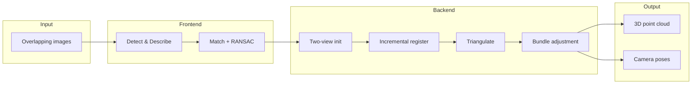

<div align="center">

# SFM-SLAM

### Structure from Motion for Sparse 3D Reconstruction & Camera Pose Estimation

<br>

**[RBD Lab](https://github.com/rbdlabhaifa) · University of Haifa**

<br>

[](https://www.python.org/)
[](https://opencv.org/)
[](https://github.com/rbdlabhaifa/SFM-SLAM)

<br>

[**Quick Start**](#quick-start) ·
[**Pipeline**](#pipeline) ·
[**Demos**](#demos) ·
[**Handover Docs**](#handover-documentation) ·
[**Repository**](https://github.com/rbdlabhaifa/SFM-SLAM)

</div>

---

<br>

## Abstract

> We provide a **Structure from Motion (SfM)** scaffold for reconstructing a sparse **3D point cloud** and estimating **camera poses** from a set of overlapping images. The pipeline follows the classical incremental SfM recipe — feature detection, robust matching, two-view initialization, incremental registration, triangulation, **bundle adjustment**, and optional **loop closure** — implemented as an extensible Python class intended for robotics and SLAM coursework at the RBD Lab.

> **Current status:** [`sfm.py`](sfm.py) defines the full pipeline orchestration in `run()`, but individual stages are **stubs** awaiting implementation. A working [**keypoint matching demo**](demos/demo_keypoints.py) is included for the first pipeline stage.

<br>

<div align="center">

```
  📷 Images  →  🔍 Features  →  🔗 Match  →  📐 Pose  →  ☁️ Point Cloud
```

*Inspired by modern view-synthesis project pages — built for teaching, not production NeRF rendering.*

</div>

<br>

---

## Pipeline

<div align="center">

| Stage | Method | Status |
|:---:|:---|:---:|
| 1 | Keypoint detect & describe (SIFT / ORB / AKAZE) | ✅ Demo |
| 2 | Cross-image descriptor matching | ✅ Demo |
| 3 | Robust estimation (RANSAC) | ✅ Demo |
| 4 | Two-view initialization | 🔧 Stub |
| 5 | Incremental PnP + triangulation | 🔧 Stub |
| 6 | Bundle adjustment | 🔧 Stub |
| 7 | Loop closure & global BA | 🔧 Stub |

</div>

<br>



<br>

---

## Quick Start

```bash
git clone https://github.com/rbdlabhaifa/SFM-SLAM.git
cd SFM-SLAM

python3 -m venv .venv && source .venv/bin/activate
pip install -r requirements.txt

cp config.yaml.example config.yaml
# Edit images_dir → folder with ≥2 overlapping JPG/PNG images

python demos/demo_keypoints.py
# → output/matches_*.jpg
```

### Run the scaffold (after implementing stubs)

```python
from pathlib import Path
import cv2
from sfm import StructureFromMotion

paths = sorted(Path("your-images").glob("*.jpg"))
images = [cv2.imread(str(p)) for p in paths]

sfm = StructureFromMotion(images, feature_detector="SIFT")
camera_poses, point_cloud = sfm.run()
```

<br>

---

## Demos

| Demo | Command | Output |
|---|---|---|
| **Keypoint matching** | `python demos/demo_keypoints.py` | Match visualization JPGs in `output/` |
| **Full SfM pipeline** | Implement stubs in `sfm.py`, then `sfm.run()` | Poses + sparse cloud (planned) |

Full walkthrough: **[demos/README.md](demos/README.md)**

<br>

---

## Configuration

No `.env` file. Copy the template:

```bash
cp config.yaml.example config.yaml
```

| Key | Description |
|---|---|
| `images_dir` | Absolute path to input image folder |
| `feature_detector` | `SIFT`, `ORB`, or `AKAZE` |
| `match_ratio` | Lowe ratio test threshold (default `0.75`) |
| `ransac_threshold` | RANSAC pixel threshold |
| `output_dir` | Writable output directory |
| `max_images` | Cap images processed (`0` = all) |
| `save_match_plots` | Write match visualizations |

> `config.yaml` is gitignored. The `.example` file is the committed template.

<br>

---

# Handover Documentation

<details open>
<summary><strong>1. Project Overview</strong></summary>

<br>

**SFM-SLAM** is a **Python educational scaffold** for classical Structure from Motion — the geometric counterpart to learning-based view synthesis (e.g. [NeRF](https://www.matthewtancik.com/nerf)). It turns unordered or sequential photographs into a sparse 3D model plus camera extrinsics, suitable as a stepping stone toward COLMAP, ORB-SLAM, or neural rendering pipelines used elsewhere in the RBD Lab ecosystem ([simulatorMapping](https://github.com/rbdlabhaifa/simulatorMapping), [RBD-SLAM](https://github.com/rbdlabhaifa/RBD-SLAM)).

**Users:** CS / robotics students implementing SfM from scratch; researchers prototyping custom feature matchers or BA backends.

**Not included:** dense reconstruction, NeRF training, GPU acceleration, or production-grade COLMAP parity.

</details>

<details>
<summary><strong>2. Architecture & Tech Stack</strong></summary>

<br>

| Layer | Technology |
|---|---|
| Language | Python 3.10+ |
| Vision | OpenCV (`opencv-python`, `opencv-contrib-python`) |
| Numerics | NumPy |
| Config | YAML (`config.yaml`) |
| Pattern | Single-class pipeline (`StructureFromMotion`) |

**Layout:** one library file ([`sfm.py`](sfm.py)) + demo scripts under [`demos/`](demos/). No build step, no CMake, no submodules.

</details>

<details>
<summary><strong>3. Prerequisites</strong></summary>

<br>

- Python 3.10 or newer
- pip / venv
- **opencv-contrib** (required for SIFT on OpenCV 4.x)
- A folder of ≥2 overlapping images for demos

</details>

<details>
<summary><strong>4. Environment Setup</strong></summary>

<br>

```bash
python3 -m venv .venv
source .venv/bin/activate
pip install -r requirements.txt
cp config.yaml.example config.yaml
```

Set `images_dir` and `output_dir` to absolute paths on your machine. No API keys or cloud secrets.

</details>

<details>
<summary><strong>5. Build & Run</strong></summary>

<br>

**No compile step.**

```bash
# Runnable today
python demos/demo_keypoints.py

# After implementing sfm.py stubs
python -c "from sfm import StructureFromMotion; ..."
```

**Tests / linters:** none configured. Validate visually via `output/matches_*.jpg`.

</details>

<details>
<summary><strong>6. Repository Structure</strong></summary>

<br>

```
SFM-SLAM/
├── sfm.py                 # ★ StructureFromMotion class (pipeline scaffold)
├── config.yaml.example    # ★ Config template
├── requirements.txt
├── demos/
│   ├── demo_keypoints.py  # ★ Runnable stage-1 demo
│   └── README.md
└── README.md
```

</details>

<details>
<summary><strong>7. Core Workflows & Data Flow</strong></summary>

<br>

**Implemented today (demo):**

```
config.yaml → demo_keypoints.py
  → load images → detect (SIFT/ORB/AKAZE)
  → match → RANSAC filter → save match JPGs
```

**Planned (`sfm.run()`):**

```
images[] → detect_and_describe_keypoints()
        → match_keypoints()
        → robustly_estimate_matches()
        → initialize_structure()          # two-view
        → for each remaining image:
              estimate_camera_pose()      # PnP
              triangulate_new_points()
              update_existing_points()
              bundle_adjustment()
        → detect_loop_closure()
        → global_optimization()
        → (camera_poses, point_cloud)
```

**Start reading:** [`sfm.py`](sfm.py) method docstrings → [`demos/demo_keypoints.py`](demos/demo_keypoints.py).

</details>

<details>
<summary><strong>8. Deployment & CI/CD</strong></summary>

<br>

Local Python only. No Docker, cloud, or CI pipelines. Run on any machine with OpenCV installed.

</details>

<details>
<summary><strong>9. Known Quirks & Technical Debt</strong></summary>

<br>

| Issue | Impact |
|---|---|
| **All `sfm.py` methods are `pass` stubs** | `run()` crashes if called unchanged |
| **`final_camera_poses.keys()[0]` in `run()`** | Python 3 incompatible syntax — fix when implementing |
| **No bundle adjustment backend** | Need scipy / ceres / g2o binding |
| **No sample images in repo** | Bring your own dataset |
| **SIFT patent note** | Use ORB/AKAZE if contrib build unavailable |

</details>

<details>
<summary><strong>10. Troubleshooting</strong></summary>

<br>

**`ModuleNotFoundError: cv2`** → `pip install opencv-python opencv-contrib-python`

**`Missing config.yaml`** → `cp config.yaml.example config.yaml`

**`Need at least 2 images`** → add overlapping photos to `images_dir`

**SIFT not available** → install `opencv-contrib-python` or set `feature_detector: ORB`

**Empty match plots** → increase overlap between consecutive frames; lower `match_ratio`

</details>

<br>

---

<div align="center">

### Related RBD Lab Projects

[simulatorMapping](https://github.com/rbdlabhaifa/simulatorMapping) ·
[LidarDrone](https://github.com/rbdlabhaifa/LidarDrone) ·
[RBD-SLAM](https://github.com/rbdlabhaifa/RBD-SLAM)

<br>

<sub>Structure from Motion · Sparse geometry · View synthesis foundations</sub>

<br>

**[↑ Back to top](#sfm-slam)**

</div>
